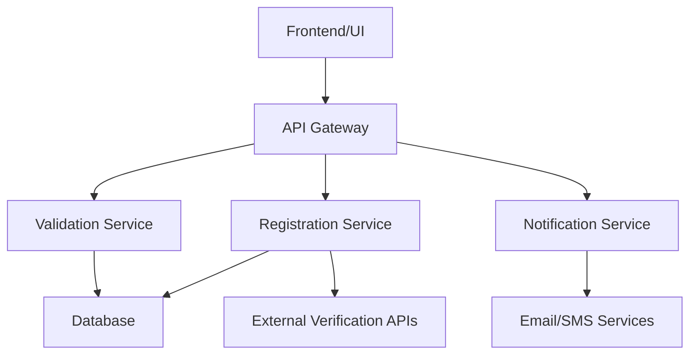

# System Architecture

## Overview
This document describes the architectural design of the Company Registration system, including its components, interactions, and design principles.

For internship assignment requirements, please refer to [INTERNSHIP_ASSIGNMENT.md](INTERNSHIP_ASSIGNMENT.md) for specific implementation guidelines and technical requirements.

## High-Level Architecture
The Company Registration system follows a layered architecture pattern consisting of:

1. **Presentation Layer**: User interfaces and API endpoints
2. **Business Logic Layer**: Core application services and business rules
3. **Data Access Layer**: Database interactions and data persistence
4. **Integration Layer**: External service connections and APIs

## Component Diagram

## Technology Components

### Backend Services
- **Registration Service**: Handles company registration workflows
- **Validation Service**: Validates company data against business rules
- **Notification Service**: Sends confirmation emails and notifications
- **Reporting Service**: Generates reports and analytics

### Data Layer
- **Primary Database**: Stores company registration data
- **Audit Log**: Tracks all registration activities
- **Cache Layer**: Improves performance for frequently accessed data

### External Integrations
- **Government Verification APIs**: For validating company information
- **Payment Gateways**: For processing registration fees
- **Email/SMS Providers**: For sending notifications

## Design Principles
- **Scalability**: Designed to handle increasing loads
- **Security**: Implements industry-standard security practices
- **Maintainability**: Modular design for easy updates
- **Reliability**: Fault-tolerant with proper error handling

## Deployment Architecture
The system is designed for cloud deployment with:
- Load balancers for traffic distribution
- Auto-scaling groups for handling variable loads
- Database replication for high availability
- CDN for static asset delivery

## Security Considerations
- All data transmission encrypted using TLS
- Authentication and authorization for all services
- Regular security audits and penetration testing
- Compliance with data protection regulations